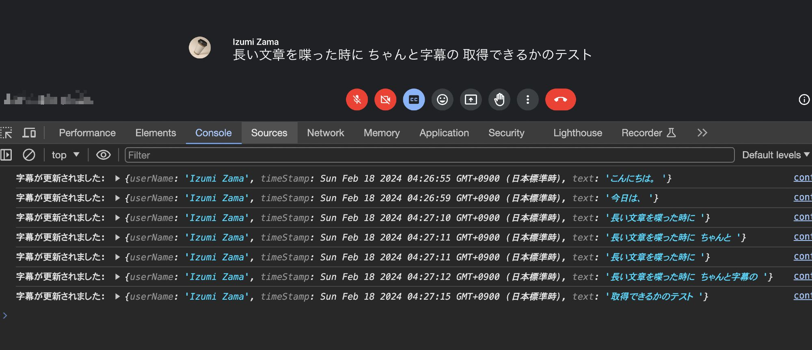

## Verbatim for Google Meet

Google Meetの字幕機能から文字を取得し、記録やAIによる要約などを目的とするChrome拡張機能の実験/プロトタイプです。

### 現段階

* 現時点で行えること
  * ユーザ名をコンソールへ出力
  * タイムスタンプをコンソールへ出力
  * 発言をコンソールへ出力

### 将来的な機能

* 何かのファイル形式でファイル出力
* ファイルを元に要約
  * → 会議時中に現段階までのまとめの生成

### 課題

* DOMの変更検知によって記録しているが、パフォーマンスにどれほど影響しているか未知数
* テキストに起こす際に、わかりやすいトランスクリプトにできるか

### ビルド方法

1. リポジトリをクローン
2. `npm install` を実行
3. `npm run build` を実行
4. Chromeの [chrome://extensions/](chrome://extensions/) からデベロッパーモードを有効
5. パッケージ化されていない拡張機能を読み込むから distの下の verbatim を選択
